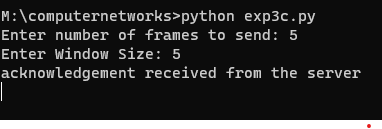
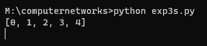

# EX-3 IMPLEMENTATION OF SLIDING WINDOW PROTOCOL


DATE :22-03-2023


## AIM :
To write a python program to perform sliding window protocol
## ALGORITHM :
1. Start the program.
2. Get the frame size from the user
3. To create the frame based on the user request.
4. To send frames to server from the client side.
5. If your frames reach the server it will send ACK signal to client otherwise it
will send NACKsignal to client.
6. Stop the program


## PROGRAM :
### Client.py
```
import socket
s = socket.socket()
s.bind(('localhost', 8000))
s.listen(5)
c, addr = s.accept()
size = int(input("Enter number of frames to send: "))
l = list(range(size))
window_size = int(input("Enter Window Size: "))
start = 0
i = 0
while True:
    while i < len(l):
        start += window_size
        c.send(str(l[i:start]).encode())
        ack = c.recv(1024).decode()
        if ack:
            print(ack)
        i += window_size
```
### Server.py
```
import socket
s = socket.socket()
s.connect(('localhost', 8000))
OUTPUT :	while True:
    print(s.recv(1024).decode())
    s.send("acknowledgement received from the server".encode())
```


## OUTPUT :
### Client

### Server


## RESULT:
Thus, python program to perform stop and wait protocol was successfully executed.

